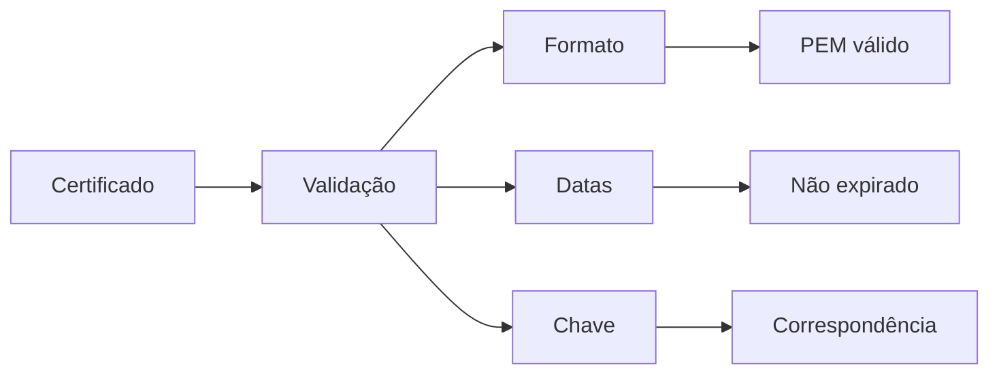

# 🔐 SSL Validator| Script de teste de certificados

<div align="center">
  
  
<div align="center">
  <a href="https://github.com/rafcsx/ssl-tester">
    
  </a>
  <a href="https://pypi.org/project/ssl-tester-pro">
    
  </a>
</div>

## 🔍 Visão geral

**Ferramenta Python** para validação completa de certificados SSL/TLS com:

- Verificação de formato PEM/X.509
- Teste de conexão SSL real
- Análise de datas de validade
- Matching entre certificado e chave privada



## 🛠️ Tecnologias

<div align="center">
  
</div>

## 🎥 Demonstração/use

[](https://www.youtube.com/watch?v=YT1utyOM4dM)

## 📌 Exemplo de Saída

```
[✓] Certificado validado com sucesso!
- Válido de: Jan 1 2023 até Dec 31 2024
- Emissor: Let's Encrypt
- Protocolo: TLS 1.3
- Cipher Suite: TLS_AES_256_GCM_SHA384
```

## 🛡️ Funcionalidades principais

1. **Validação Completa de Certificados**
   - Verificação de formato PEM
   - Checagem de datas de validade
   - Análise de correspondência com chave privada

2. **Teste de Conexão SSL**
   - Servidor HTTPS local para testes
   - Análise de protocolos suportados
   - Verificação de cipher suites

3. **Interface Amigável**
   - Efeitos visuais interativos
   - Relatórios detalhados
   - Logs completos

<div align="center">
  
</div>
